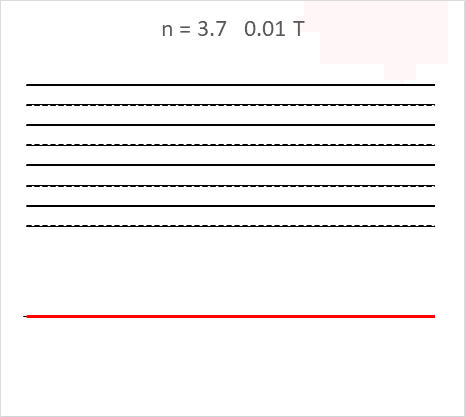

## 共振のシミュレーション動画

[『初等物理学における共鳴・共振現象に関する教材研究 ― 気柱と弦の振動 ―』](https://nagasaki-u.repo.nii.ac.jp/?action=pages_view_main&active_action=repository_view_main_item_detail&item_id=10911&item_no=1&page_id=13&block_id=21)  をもとに作成

発表者　_______  
[ウェブサイト版](https://phys-ken.github.io/Resonance_Mov/Slide.html)  
[Githubのページ](https://phys-ken.github.io/Resonance_Mov/README.html)

---

# 弦の共振

---

### 弦の共振
* 両端で反射する波が連続で重なりあう。弦の長さと波長がちょうど良い関係のとき、合成波は大きく成長する。

---

### 参考:実験の図

---

### 作成したアニメの例(パルス波)

  
弦に生じたパルス波が両端で反射する。

---

### 作成したアニメの例(連続波)

  

|左:共振|右:共振ではない|
|--|--|

---

# 基本振動
<video controls width="560">
    <source src="string/1.0.mp4" type="video/mp4">
    Sorry, your browser doesn't support embedded videos.
</video>

---

# 1.5倍振動
<video controls width="560">
    <source src="string/1.5.mp4" type="video/mp4">
    Sorry, your browser doesn't support embedded videos.
</video>

---

# 2倍振動
<video controls width="560">
    <source src="string/2.0.mp4" type="video/mp4">
    Sorry, your browser doesn't support embedded videos.
</video>

---

# 2.5倍振動
<video controls width="560">
    <source src="string/2.5.mp4" type="video/mp4">
    Sorry, your browser doesn't support embedded videos.
</video>

---

# 3倍振動
<video controls width="560">
    <source src="string/3.0.mp4" type="video/mp4">
    Sorry, your browser doesn't support embedded videos.
</video>

---

# 3.5倍振動
<video controls width="560">
    <source src="string/3.5.mp4" type="video/mp4">
    Sorry, your browser doesn't support embedded videos.
</video>

---

# 3.7倍振動
<video controls width="560">
    <source src="string/3.7.mp4" type="video/mp4">
    Sorry, your browser doesn't support embedded videos.
</video>

---

# 4倍振動
<video controls width="560">
    <source src="string/4.0.mp4" type="video/mp4">
    Sorry, your browser doesn't support embedded videos.
</video>

---

# 4.5倍振動
<video controls width="560">
    <source src="string/4.5.mp4" type="video/mp4">
    Sorry, your browser doesn't support embedded videos.
</video>

---

# 5倍振動
<video controls width="560">
    <source src="string/5.0.mp4" type="video/mp4">
    Sorry, your browser doesn't support embedded videos.
</video>

---

# 5.5倍振動
<video controls width="560">
    <source src="string/5.5.mp4" type="video/mp4">
    Sorry, your browser doesn't support embedded videos.
</video>

---

# 6倍振動
<video controls width="560">
    <source src="string/6.0.mp4" type="video/mp4">
    Sorry, your browser doesn't support embedded videos.
</video>

---

# 気柱の共鳴(開管)

---

### 基本振動
<video controls width="560">
    <source src="open/n=1.mp4" type="video/mp4">
    Sorry, your browser doesn't support embedded videos.
</video>

---

### 1.5倍振動?
<video controls width="560">
    <source src="open/n=1.5.mp4" type="video/mp4">
    Sorry, your browser doesn't support embedded videos.
</video>

---

### 2倍振動
<video controls width="560">
    <source src="open/n=2.mp4" type="video/mp4">
    Sorry, your browser doesn't support embedded videos.
</video>

---

### 2.5振動
<video controls width="560">
    <source src="open/n=2.5.mp4" type="video/mp4">
    Sorry, your browser doesn't support embedded videos.
</video>

---

### 3倍振動
<video controls width="560">
    <source src="open/n=3.mp4" type="video/mp4">
    Sorry, your browser doesn't support embedded videos.
</video>

---

### 3.5振動
<video controls width="560">
    <source src="open/n=3.5.mp4" type="video/mp4">
    Sorry, your browser doesn't support embedded videos.
</video>

---

### 4倍振動
<video controls width="560">
    <source src="open/n=4.mp4" type="video/mp4">
    Sorry, your browser doesn't support embedded videos.
</video>

---

#　気柱の共鳴(閉管)

---

### 4倍振動
<video controls width="560">
    <source src="close/n=4.mp4" type="video/mp4">
    Sorry, your browser doesn't support embedded videos.
</video>

